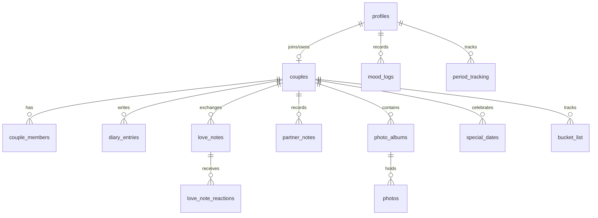

# Couple App - Master Developer & Architecture Guide

This file serves as the **Single Source of Truth** for the Couple App codebase. Before making any code modifications, implementing new features, or troubleshooting bugs, read this file to understand the architecture, database schema, directory structure, and established design patterns.

---

## 1. Project Overview & Architecture

Couple App is a private, pastel-romantic themed space designed exclusively for couples to connect, track their days together, share journals, upload photos, log moods, and stay updated on important calendar events. 

The workspace is a monorepo-style structure organized as follows:

```
Couple-App/
├── frontend/             # Next.js 16 Web Application (Web App Router)
├── supabase/             # Supabase database config & migrations
│   └── migrations/       # SQL Migration scripts
├── backend/              # Placeholder for future backend services (currently empty/Supabase-driven)
├── mobile/               # Expo Router Hybrid Mobile Client (React Native)
└── project_summary.md    # This master document
```

---

## 2. Technology Stack

### Frontend
- **Core Framework**: [Next.js 16](https://nextjs.org/) (using App Router and React Server Components).
- **Bundler/Compiler**: Next.js Turbopack (`next dev --turbo`).
- **Language**: TypeScript (`TSX` / `TS`).
- **Styling**: Vanilla CSS styled with custom CSS variables (`globals.css`) for ultimate flexibility. CSS styling is enhanced by Lucide icons (`lucide-react`) and responsive layout utility classes.
- **Database Client**: `@supabase/ssr` for server-side auth & data handling, and `@supabase/supabase-js` for browser-side real-time operations.

### Mobile
- **Core Framework**: [Expo React Native](https://expo.dev/) using file-based Expo Router.
- **Language**: TypeScript (`TSX` / `TS`).
- **Styling**: Native StyleSheet layouts with safe area boundaries, touch gestures, and pastel variables.
- **Database Client**: `@supabase/supabase-js` coupled with `@react-native-async-storage/async-storage` for secure device session persistence.

### Backend & Database
- **Backend as a Service (BaaS)**: [Supabase](https://supabase.com/).
- **Database**: PostgreSQL (hosted on Supabase) with Row Level Security (RLS) policies.
- **Authentication**: Supabase Auth (Email/Password, Email Magic OTP Links, and Google OAuth).

---

## 3. Database Schema Map

The PostgreSQL schema consists of **14 tables** under the `public` schema. All user data is keyed against the default Supabase `auth.users` table.



### Table Breakdown

#### 1. `profiles`
Stores details of onboarded users. Directly linked to Supabase authentication (`auth.users`).
- `id` (uuid, primary key): Matches `auth.users.id` (cascades on delete).
- `email` (text, unique): User's primary email.
- `display_name` (text): Full or public name shown to the partner.
- `nickname` (text, nullable): Sweet name/pet name.
- `avatar_url` (text, nullable): Path or URL to the user's avatar image.
- `birthday` (date, nullable): User's birthday.
- `gender` (text, nullable): `male` | `female` | `other`.
- `period_tracking_enabled` (boolean, default false): Controls period visibility.
- `theme_preference` (text, default 'pink'): Current theme ('pink' | 'gold' | 'lotus' | 'mint' | 'navy').
- `onboarding_completed` (boolean, default false): Flow toggle.
- `created_at` (timestamptz).

#### 2. `couples`
Represents the shared space connecting two partners.
- `id` (uuid, primary key).
- `owner_id` (uuid): Profile ID of the creator of the couple.
- `invite_code` (text, unique): 6-character unique alphanumeric code used to link partners.
- `love_start_date` (date, nullable): Anniversary date (used for "days together" counter).
- `created_at` (timestamptz).

#### 3. `couple_members`
A join table linking profiles to their active couple spaces.
- `id` (uuid, primary key).
- `couple_id` (uuid, foreign key -> `couples.id`): Linked couple space.
- `user_id` (uuid, foreign key -> `profiles.id`): Member profile.
- `role` (text, default 'partner'): Role designation.
- `joined_at` (timestamptz).

#### 4. `diary_entries`
The shared relationship journal.
- `id` (uuid, primary key).
- `couple_id` (uuid, foreign key -> `couples.id`).
- `author_id` (uuid, foreign key -> `profiles.id`).
- `title` (text, nullable): Entry title.
- `content` (text): Main rich journal text.
- `is_private` (boolean, default false): If true, only visible to the author.
- `created_at` (timestamptz).

#### 5. `love_notes`
Romantic letters exchanged between the couple.
- `id` (uuid, primary key).
- `couple_id` (uuid, foreign key -> `couples.id`).
- `sender_id` (uuid, foreign key -> `profiles.id`).
- `receiver_id` (uuid, foreign key -> `profiles.id`).
- `message` (text): Note contents.
- `reveal_at` (timestamptz, nullable): Lock note until this time.
- `is_read` (boolean, default false).
- `is_hidden` (boolean, default false).
- `created_at` (timestamptz).

#### 6. `love_note_reactions`
Reactions sent on unlocked love notes.
- `id` (uuid, primary key).
- `love_note_id` (uuid, foreign key -> `love_notes.id`).
- `user_id` (uuid, foreign key -> `profiles.id`).
- `reaction_type` (text): `heart` | `hug_back` | `touched` | `gentle`.
- `created_at`, `updated_at` (timestamptz).

#### 7. `mood_logs`
Logs showing daily emotions for emotional syncing.
- `id` (uuid, primary key).
- `user_id` (uuid, foreign key -> `profiles.id`).
- `couple_id` (uuid, foreign key -> `couples.id`).
- `mood` (text): Emotional status identifier (e.g. `happy`, `sad`, `tired`, `angry`).
- `note` (text, nullable): Context description.
- `date_key` (text): Unique key formatted as `YYYY-MM-DD`.
- `created_at` (timestamptz).

#### 8. `partner_notes`
The shared "Notebook" category helper (likes, dislikes, sizes, habits).
- `id` (uuid, primary key).
- `couple_id` (uuid, foreign key -> `couples.id`).
- `created_by` (uuid, foreign key -> `profiles.id`).
- `category` (text): `like` | `dislike` | `food` | `gift` | `habit` | `remember` | `note`.
- `content` (text): Detail description.
- `created_at`, `updated_at` (timestamptz).

#### 9. `photo_albums`
Collections grouping uploaded images.
- `id` (uuid, primary key).
- `couple_id` (uuid, foreign key -> `couples.id`).
- `title` (text): Album name.
- `created_by` (uuid, foreign key -> `profiles.id`).
- `created_at` (timestamptz).

#### 10. `photos`
Images stored inside albums.
- `id` (uuid, primary key).
- `album_id` (uuid, foreign key -> `photo_albums.id`).
- `couple_id` (uuid, foreign key -> `couples.id`).
- `uploaded_by` (uuid, foreign key -> `profiles.id`).
- `image_url` (text): Public bucket storage url.
- `caption` (text, nullable).
- `location` (text, nullable).
- `taken_at` (timestamptz, nullable).
- `created_at` (timestamptz).

#### 11. `special_dates`
Anniversaries, birthdays, countdowns.
- `id` (uuid, primary key).
- `couple_id` (uuid, foreign key -> `couples.id`).
- `title` (text): Event title.
- `type` (text): Event category.
- `date` (date): Calender date.
- `description` (text, nullable).
- `repeat_yearly` (boolean, default true).
- `created_by` (uuid, foreign key -> `profiles.id`).
- `created_at`, `updated_at` (timestamptz).

#### 12. `period_tracking`
Confidential physiological calendar configuration.
- `id` (uuid, primary key).
- `user_id` (uuid, foreign key -> `profiles.id`, unique).
- `last_period_date` (date): First day of the last menstrual cycle.
- `cycle_length` (integer, default 28).
- `period_length` (integer, default 5).
- `notifications_enabled` (boolean, default true).
- `share_with_partner` (boolean, default false): Controls sync permissions.
- `created_at`, `updated_at` (timestamptz).

#### 13. `notifications`
System alerts and messages.
- `id` (uuid, primary key).
- `couple_id` (uuid, foreign key -> `couples.id`, nullable).
- `user_id` (uuid, foreign key -> `profiles.id`): Recipient.
- `sender_id` (uuid, foreign key -> `profiles.id`, nullable): Initiator.
- `type` (text): Category.
- `title` (text): Display title.
- `content` (text): Display content.
- `is_read` (boolean, default false).
- `link` (text, nullable): Target destination route.
- `created_at` (timestamptz).

#### 14. `dismissed_reminders`
Suppresses dashboard alerts.
- `id` (uuid, primary key).
- `user_id` (uuid, foreign key -> `profiles.id`).
- `reminder_key` (text).
- `dismissed_until` (date).
- `created_at` (timestamptz).

### SQL Custom Functions & RPCs
- **`delete_user_account`**:
  *Parameters*: None.
  *Returns*: `void`.
  *Action*: Runs inside database security context to delete the authenticated user's records from `auth.users` directly, triggering cascading deletions across all profile-linked tables.
- **`join_couple_by_invite_code`**:
  *Parameters*: `invite_code_input` (text).
  *Returns*: `text` (status message).
  *Action*: Connects the user profile to an existing couple using a 6-digit link code.

---

## 4. Frontend Directory & Route Map

Frontend is built under Next.js App Router:

```
frontend/
├── app/                      # Next.js App Routes
│   ├── actions/              # Server Actions (auth.ts)
│   ├── album/                # Album routing & photo list
│   ├── auth/                 # Route Handlers
│   │   ├── callback/         # OAuth Google callback handler
│   │   └── confirm/          # Cookie preservation / verify OTP confirm handler
│   ├── calendar/             # Shared calendar & countdowns
│   ├── dashboard/            # Home view (DashboardPage)
│   ├── future/               # Future mock screens
│   ├── journal/              # Journal/Diary entries list and editors
│   ├── login/                # LoginPage route
│   ├── love/                 # Interaction board
│   ├── onboarding/           # Onboarding routes
│   ├── register/             # RegisterPage route
│   ├── reset-password/       # ResetPasswordPage & ResetPasswordForm
│   ├── settings/             # SettingsPage route
│   ├── globals.css           # Core stylesheet (CSS variable definitions)
│   ├── layout.tsx            # Global layout wrapper
│   └── page.tsx              # Root index (redirects to /dashboard)
├── components/               # UI components library
│   ├── auth/                 # AuthCard.tsx (Login/Signup/Forgot password UI)
│   ├── dashboard/            # DashboardHome.tsx, CoupleMoodSync.tsx
│   ├── layout/               # AppShell.tsx (Header/Sidebar/BottomNav wrapper)
│   ├── settings/             # SettingsView.tsx (Options page & Danger Zone UI)
│   └── notebook/             # NotebookSpace.tsx
├── lib/                      # Business logic helpers
│   ├── supabase/             # Client/Server context initializers
│   ├── couple.ts             # Fetching partner & couple info
│   └── profile.ts            # Profile fetching & onboarding verifiers
└── types/                    # TypeScript definitions (database.ts)
```

---

## 5. Styling & Dynamic Theme Engine

Theme colors are determined via **CSS variables** globally defined in [globals.css](file:///f:/HDUC/DuAn/Couple-App/frontend/app/globals.css).

The application shifts between **5 predefined visual themes** saved in `profiles.theme_preference`:

| Theme Key | Visual Mood | Dominant CSS Variables |
|---|---|---|
| `pink` | Pastel Rose | `--color-primary: #a3496d`, `--color-card: #ffffff`, `--color-soft: #fff5f8` |
| `gold` | Luxury Amber | `--color-primary: #855e1a`, `--color-card: #fcfbf7`, `--color-soft: #f7ecd3` |
| `lotus` | Clean White Lotus | `--color-primary: #b3974b`, `--color-card: #fffcf8`, `--color-soft: #fbf5e6` |
| `mint` | Sage Botanics | `--color-primary: #3b5c4a`, `--color-card: #f8faf9`, `--color-soft: #edf3f0` |
| `navy` | Night Sparkle | `--color-primary: #1e3a8a`, `--color-card: #0f172a`, `--color-soft: #1e293b` (Dark Mode) |

The theme variables are rendered dynamically via a theme provider wrapping the React tree, applying a database class (e.g. `theme-pink` or `theme-gold`) directly to the html container.

---

## 6. Crucial Business Flows & Logic

### 1. Registration & Onboarding Flow
1. User registers via `registerAction()` in [auth.ts](file:///f:/HDUC/DuAn/Couple-App/frontend/app/actions/auth.ts).
2. Receives a verification link via email or signs in via Google OAuth.
3. If they haven't completed onboarding, [page.tsx](file:///f:/HDUC/DuAn/Couple-App/frontend/app/page.tsx) or dashboard dynamic routes will redirect them to `/onboarding/profile`.
4. User fills out details (display name, gender, birthday).
5. User is redirected to the dynamic couple pairing space `/onboarding/couple`. They can either:
   - Create a new couple (generates a random `invite_code`).
   - Enter their partner's `invite_code` to call `join_couple_by_invite_code` and link their spaces.
6. Once connected, the user is navigated to the `/dashboard`.

### 2. Password Recovery (Forgot/Reset) Flow
- **Request Link**: User clicks "Quên mật khẩu?" in `AuthCard.tsx` (Login mode), typing their email. This calls `forgotPasswordAction()` in [auth.ts](file:///f:/HDUC/DuAn/Couple-App/frontend/app/actions/auth.ts).
- **Redirect handler**: Supabase resets link redirects to `/auth/confirm?token_hash=...&type=recovery&next=/reset-password`.
- **Otp Confirmation**: [route.ts](file:///f:/HDUC/DuAn/Couple-App/frontend/app/auth/confirm/route.ts) confirms OTP hash and uses a server-client helper to preserve set-cookie persistence across routes, then forwards to `/reset-password`.
- **Form Submission**: `/reset-password` renders `ResetPasswordForm.tsx` where they update credentials via `resetPasswordAction()`.

### 3. Danger Zone Account Deletion Flow
1. Located in **Settings** under **Quyền riêng tư** (Privacy tab in `SettingsView.tsx`).
2. Displays warning text inside a styled light-red alert container.
3. User must type the confirmation string exactly: `XÓA TÀI KHOẢN`.
4. Trigger calls supabase RPC `delete_user_account`.
5. DB function deletes user cascadingly; supabase client signs out client, and redirects to `/login`.

---

## 7. Developer Cheat Sheet & Common Operations

### Dev Command Line Scripts
Run these commands from the **workspace root** directory:

```bash
# Start local development server (with Turbopack)
npm run dev

# Run Next.js production build check
npm run build --prefix frontend

# Format files using Prettier/ESLint (if configured)
npm run lint --prefix frontend
```

### How to Create a Database Migration
1. Create a new SQL script in `supabase/migrations/` (format: `XXX_name_of_migration.sql`).
2. Write raw PostgreSQL statements (adding tables, RLS rules, functions).
3. If you add database tables or functions, regenerate typescript type definitions by running:
   ```bash
   npx supabase gen types typescript --project-id YOUR_PROJECT_ID > frontend/types/database.ts
   ```

### UI and Aesthetics Policy
- **Responsiveness**: Everything must look like a premium Native Mobile App on screens smaller than `768px` (using bottom sheet patterns, flexible height blocks, and touch-friendly actions) while maintaining a balanced dashboard layout on desktop screen sizes.
- **Theme Variables**: **Do not hardcode hex color strings** inside components. Use theme CSS variables (e.g. `var(--color-primary)`, `var(--color-soft)`, `var(--color-muted)`) so style changes apply correctly when users shift active themes.

---

*This guide will be updated as new features are integrated. Always commit updates to this summary file when changing core infrastructure.*
